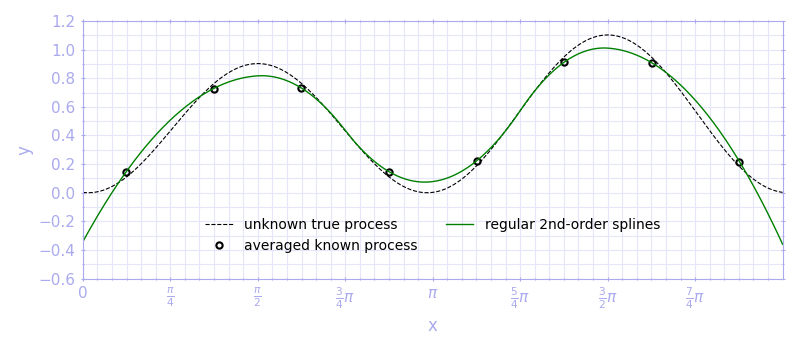
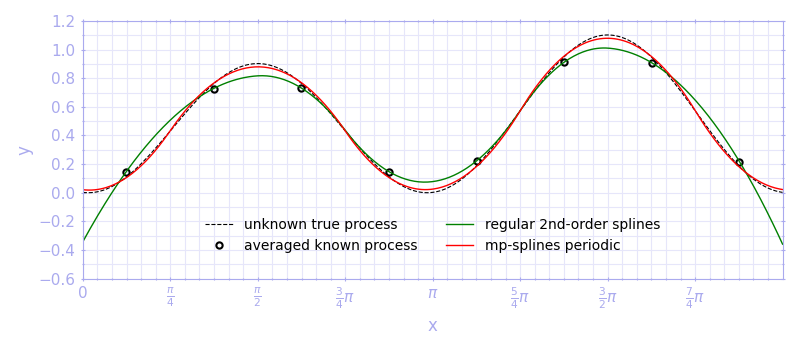
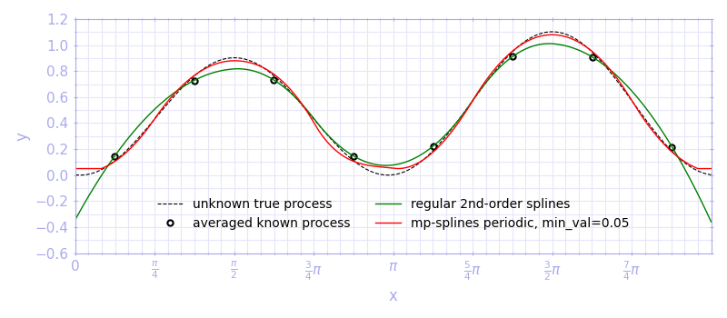

## mpsplines: Mean preserving interpolation with splines

The mean-preserving interpolation with splines is published in:

> Ruiz-Arias, J. A. (2022). Mean-preserving interpolation with splines for solar radiation modeling. _Solar Energy_, Vol. 248, pp. 121-127. doi: [10.1016/j.solener.2022.10.038](https://doi.org/10.1016/j.solener.2022.10.038) (open access)

### Installation:

```bash
python3 -m pip install git+https://github.com/jararias/mpsplines.git
```

### Usage:

The usage of ```mpsplines``` is so simple that is better explained with an example.

```python
import numpy as np
import pylab as pl

# unknown process
x = np.linspace(0., 2*np.pi, 480)
y = (0.05 - np.sin(x))**2

# we only know some averages
xi = np.reshape(x, (8, 60)).mean(axis=1)
yi = np.reshape(y, (8, 60)).mean(axis=1)

pl.figure(figsize=(8, 3.5))

pl.plot(x, y, 'k--', lw=.8, label='unknown true process')
pl.plot(xi, yi, 'ko', ms=4.5, mfc='none', mew=1.5, mec='k',
        label='averaged known process')
saveplot(1)
```

where ```y``` is the unknown process that we want to reconstruct, but we only know the averages:


*```saveplot``` is a function that formats and saves the plot. You can find the code in [tests/intro_example.py](https://github.com/jararias/mpsplines/blob/5507cb12bb125ad09395e96534beeb745623a687/tests/intro_example.py).

If we make a regular splines interpolation, the interpolated curve will go through the interpolation nodes:

```python
from scipy.interpolate import interp1d

sp2 = interp1d(xi, yi, kind=2, bounds_error=False, fill_value='extrapolate')

pl.plot(x, sp2(x), 'g-', lw=1, label='regular 2nd-order splines')
saveplot(2)
```



This interpolator is exact and inappropriate in this situation. If we rather use ```mpsplines```:

```python
from mpsplines import (
    MeanPreservingInterpolation as MPI
)

mpi = MPI(yi=yi, xi=xi)
pl.plot(x, mpi(x), 'r-', lw=1, label='mp-splines')
saveplot(3)
```


The unknown process is much better reconstructed with mp-splines, especially at the relative maxima and minima.

But we also know that this particular unknown process is periodic. We can let mp-splines know about it:

```python
mpi = MPI(yi=yi, xi=xi, periodic=True)
pl.plot(x, mpi(x), 'r-', lw=1, label='mp-splines periodic')
saveplot(3)
```



Now the fit of the mp-splines interpolated results to the unknown process is very good.

Let assume that, for some reason, we also know that the interpolated values cannot be smaller than 0.05. Then:

```python
mpi = MPI(yi=yi, xi=xi, periodic=True, min_val=0.05, cubic_window_size=3)
pl.plot(x, mpi(x), 'r-', lw=1, label='mp-splines periodic, min_val=0.05')
saveplot(3)
```



Note that I am using ```cubic_window_size=3```. It is the number of splines that are _relaxed_ around the splines that goes beyond 0.05. It must be an odd number that, by default, is set to 9, meaning that 4 splines on each site are relaxed. However, we have so few interpolation nodes in this example that 9 is too high. Then, I set the number of relaxed splines to 3 only (one on each side).

### Use of mpsplines with time series and monthly climatologies

```mpsplines``` is ready to work with time series and monthly climatologies out-of-the-box. For examples, have a look at the scripts in [mpsplines/paper](https://github.com/jararias/mpsplines/tree/paper).
